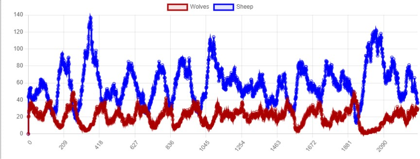

# SMA_Wolf_Sheep_Predation

## Representation and implementation choices

 

### Sheep

For the sheep agents here are the choices we have made: 
- Sheep agents are placed randomly on the grid during initialization. You can choose their initial number using a slider.
- A sheep agent has the following parameters: 
    1. Energy: Energy levels of a sheep decrease when it moves or reproduces, while they increase when it consumes grass. The energy won when eating grass can also be modified with a slider.
    2. Position: A tuple with position x and y on the grid. The position change each turn.
    3. Moore: The neighborhood is calculated using Moore, which means that the eight cells surrounding an agent are considered.

Each turn a sheep: 
- Walks around with *random_move()* method.
- Reproduces (asexually) if the probability is met and then see its energy divided by 2.
- Eats grass if he can reach one.
- Dies if its energy is too low.

 

### Wolves

For the wolves agents here are the choices we have made: 
- Wolves agents are placed randomly on the grid on the initialization. You can choose their initial number with a slider.
- A wolf agent has the following parameters: 
    1. Energy: Energy levels of a wolf decrease when it moves or reproduces, while they increase when it consumes sheep. The energy won when eating sheep can also be modified with a slider.
    2. Position: A tuple with position x and y on the grid. The position change each turn.
    3. Moore: The neighborhood is calculated using Moore, which means that the eight cells surrounding an agent are considered.

Each turn a wolf: 
- Walks around with *random_move()* method.
- Reproduces (asexually) if the probability is met and then see its energy divided by 2.
- Eats sheep if he can reach one, only if he is hungry (energy below a certain value) and only one at the time.
- Dies if its energy is too low.

 

### Grass 

For the grass agents here are the choices we have made:
- Grass agents fill the grid during the initialization.
- A grass agent has the following parameters: 
  1. Grass regrowth time: It is the time taken for a grass patch to regrow.
  2. Fully grown: Boolean value that indicates wether or not a grass patch is fully grown.

Each turn a grass patch:
- Does nothing except waiting to regrow or be eaten by a sheep. 

 

### The grid 

 
 

    

On the grid, the grass patches are green, the wolves are red, and the sheep are blue. We thought that keeping the agents represented as circles would be better, as their colors correspond to the colors of the curves on the graph, helping to visualize the evolution of the population of each breed.

## Optimal parameters 

 

| Parameters                          | Value  |
| ------------------------------------|--------|
| Initial wolves                      | 20     |
| Initial sheep                       | 40     |
| Reproduction probability of Wolves  | 0.06   |
| Reproduction probability of Sheep   | 0.06   |
| Energy won when eating Sheep        | 15     |
| Energy won when eating Grass        | 10     |
| Wolves' initial energy              | 30     |
| Sheep's initial energy              | 30     |
| Grass regrowing time                | 30     |

## Population evolution graph

 

    

 

To achieve a balance in the populations of different species, we iteratively played with the parameters to see which had the greatest influence on our model. Initially, the initial number of sheep and wolves did not have a significant impact on population dynamics as long as their difference was not too large. However, the reproduction rate of the species is a sensitive parameter that has a critical impact on the evolution of our populations. An excessively high reproduction rate leads to exponential growth of the population, which may reach an equilibrium state but is far from representative of reality. Therefore, we decided to keep the reproduction rates relatively low.

Next, we had trouble with the energy gain parameter, as our sheep population was rapidly declining due to the wolves' longevity and high energy gain per meal. To address this issue, we decreased the energy gain and implemented two protections: a wolf can only eat two sheep per turn (preventing them from accumulating 200 energy at once), and they can only eat when hungry. We chose not to modify the starting energy levels, despite being high (Energy = 30), as we found it to be a good compromise since energy is halved during reproduction. Finally, we did not modify the grass regrowth time parameter as we did not observe a significant impact on our model.